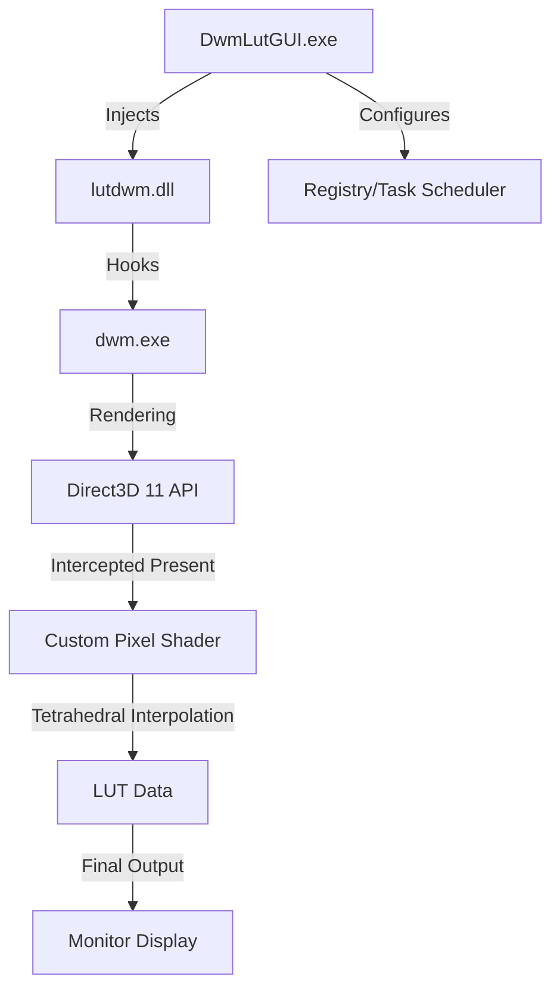

# DwmLut High-Level Documentation

## 1. Overview
DwmLut is a low-level system utility designed to apply 3D Lookup Tables (LUTs) to the Windows Desktop Window Manager (DWM). This allows for system-wide color correction, calibration, or creative grading across all applications and monitors.

The project consists of two main components:
1.  **`lutdwm.dll` (C++)**: The core engine that runs inside `dwm.exe`. It hooks into the D3D11 rendering pipeline and applies LUTs using custom shaders.
2.  **`DwmLutGUI.exe` (C# .NET)**: The management interface that allows users to configure LUTs per monitor, manage autostart, and inject the core engine into the system.

---

## 2. Core Architecture

### Architecture Diagram (Conceptual)

### The Hooking Mechanism
The project uses advanced binary hooking techniques to intercept DWM's rendering calls. 
- **Target**: `IDXGISwapChain::Present` or its internal DWM wrappers like `COverlayContext::Present`.
- **Strategy**: It identifies the correct offsets and vtable entries for various Windows versions (Windows 10, Windows 11, and specifically Windows 11 25H2).
- **Execution**: When DWM prepares a frame for display, `lutdwm.dll` intercepts the call, sets its own pixel shader (containing the tetrahedral interpolation logic), and applies the selected LUT before passing the frame to the hardware.

---

## 3. Subsystems

### 3.1. Graphics Engine (`lutdwm/dllmain.cpp`)
Responsible for the actual GPU work.
- **Shader Logic**: Implements tetrahedral interpolation for high-quality color transformations and blue-noise dithering for SDR to prevent banding.
- **AOB Scanning**: Uses "Array of Bytes" (AOB) signatures to find internal DWM functions without relying on symbols.
- **MPO Management**: Patches DWM memory to disable or manage Multi-Plane Overlays (MPO) via `OverlayTestMode`, ensuring the LUT isn't bypassed by hardware optimizations.

### 3.2. GUI & Management (`DwmLutGUI/`)
- **Monitor Discovery**: Uses `WindowsDisplayAPI` to identify active monitors and their positions.
- **Workflow**: Saves LUT assignments to `config.xml` and synchronizes them with the injected DLL via a shared memory space or temporary file communication in `%SYSTEMROOT%\Temp\luts`.
- **Injection Logic (`Injector.cs`)**: Uses standard Windows API (`OpenProcess`, `VirtualAllocEx`, `WriteProcessMemory`, `CreateRemoteThread`) to load `lutdwm.dll` into the `dwm.exe` process.

---

## 4. Windows 11 25H2 (Build 26200+) Deep Dive

The 25H2 update changed how DWM manages swap chains. The project handles this via:
- **VTable Traversal**: Instead of finding `IDXGISwapChain` directly, it traverses the `IOverlaySwapChain` vtable.
- **Coordinate Handling**: Build 26200+ shifted internal coordinate structures to integer-based storage at new offsets (e.g., `DeviceClipBox` at `0x466C` or `0x53E8` depending on the build).
- **Automation**: Current implementation includes a **Task Scheduler** integration that creates a high-privilege task to bypass UAC prompts and apply LUTs immediately upon login.

---

## 5. Technical Quick Reference

| Feature | Implementation Detail |
| :--- | :--- |
| **LUT Formula** | Tetrahedral Interpolation |
| **SDR Dithering** | Blue Noise Dithering |
| **Injection Mode** | Remote Thread Creation |
| **Autostart** | Windows Task Scheduler (`schtasks`) |
| **Hook Type** | VTable / Middleware Hook |

---

## 6. Project Roadmap & Maintenance
- **Updating Offsets**: Use the builtin logging (`C:\DWMLOG\dwm.log` in Debug builds) to verify if functions like `Present` or `OverlaysEnabled` were found.
- **Build Requirements**: Visual Studio 2022 with x64 Release configuration.
- **Dependencies**: Integrated via `vcpkg`.
